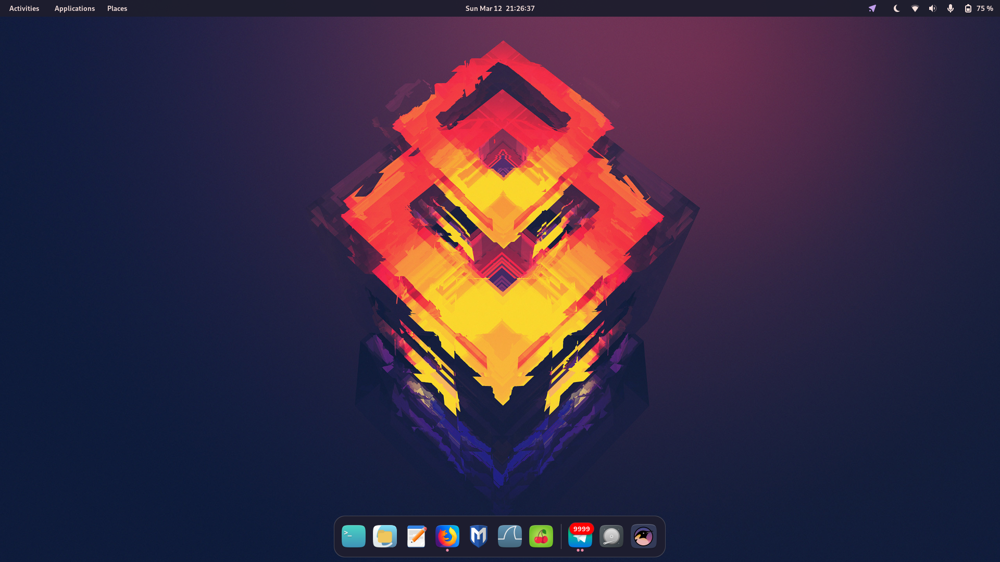
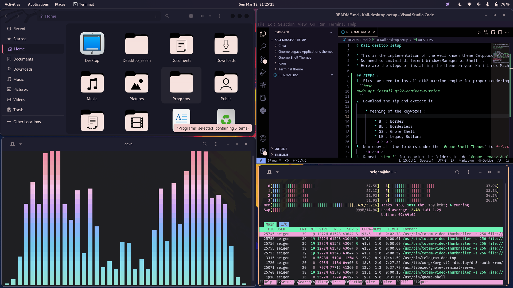

# Kali desktop setup




* This is the implementation of the well known theme Catppuccin on Kali  
 Linux with it's default configuration..
* No need to install different WindowsManager or Shell ..
* Here are the steps of installing the theme on your Kali Linux Machine.

## STEPS :
1. First we need to install gtk2-murrine-engine for proper rendering of 
  the theme.. Use this command to install the murrine engine. :
```bash
sudo apt install gtk2-engines-murrine
``` 
2. Install/Enable the extensions : 
   * [User Themes](https://extensions.gnome.org/extension/19/user-themes/)
   * [Woobly Windows](https://extensions.gnome.org/extension/3210/compiz-windows-effect/)
   * [Aylur's Widgets](https://extensions.gnome.org/extension/5338/aylurs-widgets/) (Use it to custom the status bar and other appearances in your own way...)<br><br> 
   *Before that click on **`Add extensions to the browser`***.
    <br><br>
3. Download the zip and extract it. 

    * Meaning of the keywords :

        * B  : Border
        * BL : Borderless
        * GS : Gnome Shell
        * LB : Legacy Buttons
        <br><br>
4. Now copy all the folders under the `Gnome Shell Themes` to *~/.themes*,
  or you can also copy only the theme that you want to use.
    <br><br>
5. Repeat `step 3` for copying the folders inside `Gnome Legacy Applications themes`.
    <br><br>
6. Copy all the folders inside the `Icons` folder to */usr/share/icons*.<br><br>
   **Note :** The `Catppuccin_Custom theme` can only make the icons looks like the above screenshots..
    <br><br>
7. Let's say that you want to use `Catppuccin-Mocha-B-LB`, Now open the  
  folder of the `Gnome Legacy Applications themes` 
  folder and, go to */Catppuccin-Mocha-B-LB/gtk-4.0/* and copy  all the files to 
  *~/.config/gtk-4.0* .<br><br>
8. For cava (Audio Visualizer) theme , Copy the config file and paste it 
   to */usr/share/cava/example_files* .
  <br><br>
### Installing Terminal Theme :
 * For installing the themes , check the installation procedures [here](https://github.com/catppuccin/gnome-terminal).
  <br><br>
### Installing VS code Theme :
  * For installing the themes , check the installation procedures [here](https://github.com/catppuccin/vscode).
 <br><br>
# Enjoy!!